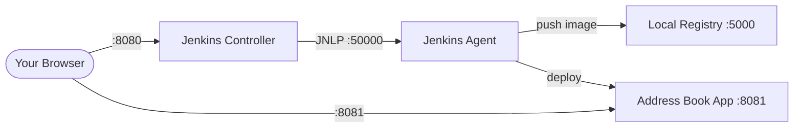
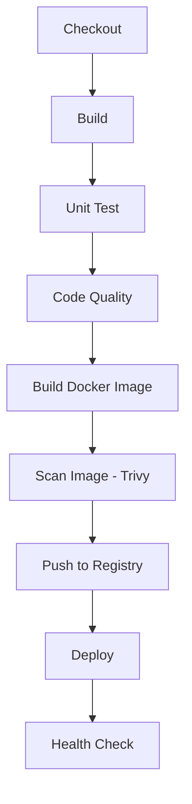

# Jenkins Learning Environment

A self-contained Jenkins CI/CD learning environment using Docker. Clone this repo, start it up, and explore a fully working DevSecOps pipeline.

## What You'll Learn

- How Jenkins automates building, testing, and deploying software
- Writing and understanding CI/CD pipelines (Jenkinsfile)
- Building and scanning Docker container images
- Code quality checks with Checkstyle and SpotBugs
- Container security scanning with Trivy
- Jenkins controller/agent architecture

## Prerequisites

- [Docker Desktop](https://www.docker.com/products/docker-desktop/) installed and running
- [Git](https://git-scm.com/downloads) installed
- ~4 GB of available RAM
- Ports 8080, 8081, and 5000 available on your machine

### Docker Registry Setup

You need to allow Docker to push to our local registry. In Docker Desktop:

1. Open **Settings** (gear icon)
2. Go to **Docker Engine**
3. Add `"insecure-registries": ["localhost:5000"]` to the JSON configuration
4. Click **Apply & Restart**

Your config should look something like:

```json
{
  "insecure-registries": ["localhost:5000"]
}
```

## Quick Start

```bash
# 1. Clone the repository
git clone <repo-url>
cd jenkins-reference

# 2. Start all services
docker compose up -d --build

# 3. Wait for Jenkins to initialize (~2 minutes)
#    You can watch the logs:
docker compose logs -f jenkins

# 4. Open Jenkins in your browser
#    URL: http://localhost:8080
#    Username: admin
#    Password: admin

# 5. The "address-book-pipeline" job is pre-configured.
#    Click on it, then click "Build Now" to trigger your first build.

# 6. After the build completes, open the Address Book app:
#    http://localhost:8081
```

## Where's the app source code?

The Spring Boot sample app lives in its own repo: [`jasoncalalang/address-book`](https://github.com/jasoncalalang/address-book). Jenkins clones it automatically each build — you don't need to clone it yourself to run the tutorial. If you want to read the code or modify it, clone it separately:

```bash
git clone https://github.com/jasoncalalang/address-book.git
```

## Architecture



| Service | URL | Purpose |
|---|---|---|
| Jenkins | http://localhost:8080 | CI/CD server |
| Address Book | http://localhost:8081 | Deployed application |
| Docker Registry | http://localhost:5000 | Local image registry |

## Pipeline Stages



## Documentation

Start with the overview and work through the docs in order:

1. [Overview](docs/01-overview.md) - CI/CD and DevSecOps concepts
2. [Architecture](docs/02-architecture.md) - How the services connect
3. [Jenkins Basics](docs/03-jenkins-basics.md) - Navigating the Jenkins UI
4. [Pipeline Stages](docs/04-pipeline-stages.md) - Understanding the Jenkinsfile
5. [Docker Build](docs/05-docker-build.md) - Containerizing applications
6. [Container Scanning](docs/06-container-scanning.md) - Security scanning with Trivy
7. [Deployment](docs/07-deployment.md) - Deploying containers
8. [Agents](docs/08-agents.md) - Jenkins controller/agent setup
9. [Webhooks](docs/09-webhooks.md) - Automatic build triggers
10. [Troubleshooting](docs/10-troubleshooting.md) - Common issues and fixes

## Cleanup

```bash
# Stop all services
docker compose down

# Also remove the deployed address book container
docker stop address-book && docker rm address-book

# Remove all data (Jenkins config, registry images)
docker compose down -v
```
