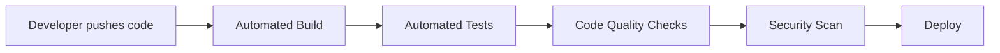

# Overview

## What is CI/CD?

**Continuous Integration (CI)** means developers frequently merge their code changes into a shared repository. Each merge triggers an automated build and test process. This catches bugs early — before they reach production.

**Continuous Delivery/Deployment (CD)** extends CI by automatically deploying tested code to a staging or production environment. The goal: every code change that passes tests can be released at any time.

## What is DevSecOps?

DevSecOps integrates security practices into every phase of the software development lifecycle. Instead of treating security as a final gate before release, security checks run automatically alongside builds and tests.

In this project, the "Sec" part comes from **Trivy** — a tool that scans our Docker container images for known security vulnerabilities.

## What is Jenkins?

Jenkins is an open-source automation server. It runs your CI/CD pipelines — the automated sequences of build, test, scan, and deploy steps. Jenkins is one of the most widely used CI/CD tools in the industry.

Key concepts:
- **Job/Pipeline**: A defined sequence of steps Jenkins executes
- **Build**: A single execution of a job
- **Jenkinsfile**: A file that defines your pipeline as code
- **Plugin**: An extension that adds functionality to Jenkins

## What We're Building

This learning environment gives you a complete CI/CD pipeline for a simple **Address Book** application:

| Component | Technology | Purpose |
|---|---|---|
| Application | Spring Boot (Java) | The software being built and deployed |
| Build tool | Gradle | Compiles code, runs tests |
| CI/CD server | Jenkins | Orchestrates the pipeline |
| Container | Docker | Packages the app for deployment |
| Security scanner | Trivy | Scans containers for vulnerabilities |
| Code quality | Checkstyle, SpotBugs | Checks code style and finds bugs |

## Next

Continue to [Architecture](02-architecture.md) to see how all the pieces connect.
