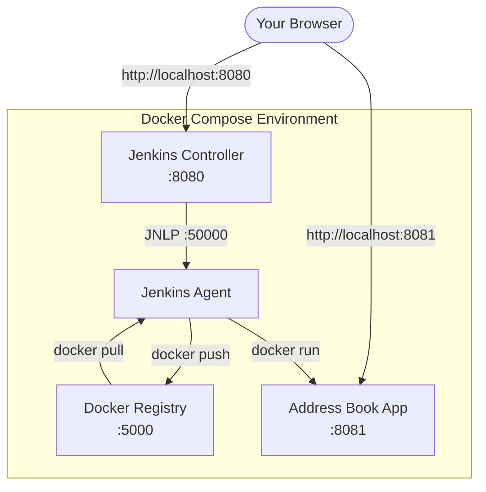
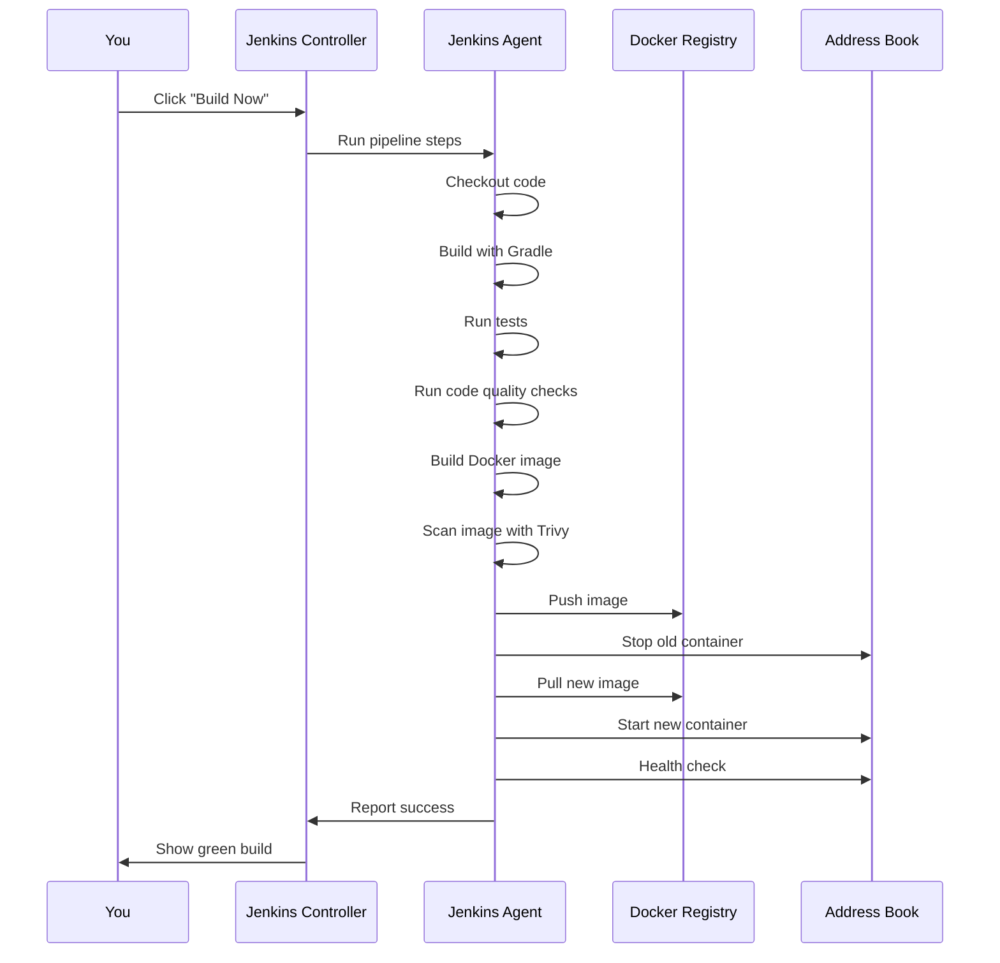

# Architecture

## Services

This environment runs four Docker containers that work together:

### Jenkins Controller

The "brain" of the operation. It stores pipeline configurations, schedules builds, and presents the web UI. It does NOT run builds itself — it delegates that to the agent.

- **URL**: http://localhost:8080
- **Login**: admin / admin

### Jenkins Agent

A worker that executes build steps on behalf of the controller. Our agent has Java, Docker CLI, and Trivy installed so it can build, test, scan, and deploy the application.

### Docker Registry

A local image repository. When the pipeline builds a Docker image of the address book, it pushes the image here. During deployment, the image is pulled from this registry.

- **URL**: http://localhost:5000

### Address Book Application

The Spring Boot application deployed by the pipeline. After a successful build, you can access it and see the running application.

- **URL**: http://localhost:8081

## Network

All services share a Docker network called `jenkins-net`. This lets them communicate by container name (e.g., the agent can reach Jenkins at `http://jenkins:8080`).

## Data Flow During a Build

## Next

Continue to [Jenkins Basics](03-jenkins-basics.md) to learn how to navigate the Jenkins UI.
