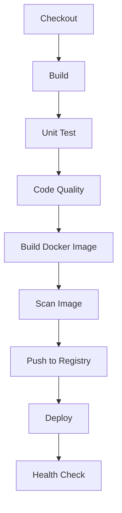

# Pipeline Stages

## The Jenkinsfile

Our pipeline is defined in [`Jenkinsfile`](https://github.com/jasoncalalang/address-book/blob/main/Jenkinsfile) in the separate [`address-book`](https://github.com/jasoncalalang/address-book) repository. Jenkins clones that repo automatically at the start of every build. This is a **declarative pipeline** — Jenkins reads this file and executes the stages in order.

### Structure

```groovy
pipeline {
    agent { label 'docker-agent' }   // Run on our agent

    stages {
        stage('Name') {              // A named step
            steps {
                sh 'command'         // Shell commands to run
            }
        }
    }

    post {                           // Actions after all stages
        always { /* always runs */ }
        success { /* on success */ }
        failure { /* on failure */ }
    }
}
```

## Stage-by-Stage Walkthrough



### 1. Checkout

```groovy
checkout scm
```

Pulls the source code from the Git repository into the agent's workspace. Every build starts with a fresh copy of the code.

### 2. Build

```groovy
sh './gradlew build -x test'
```

Compiles the Java source code and packages it into a JAR file. The `-x test` flag skips tests (we run them in the next stage for cleaner reporting).

### 3. Unit Test

```groovy
sh './gradlew test'
```

Runs all JUnit tests. Results are published to Jenkins so you can see them in the UI. If any test fails, the pipeline stops.

### 4. Code Quality

```groovy
sh './gradlew checkstyleMain spotbugsMain'
```

- **Checkstyle**: Checks code formatting and style rules
- **SpotBugs**: Analyzes bytecode for potential bugs

Results are published via the `warnings-ng` plugin and visible in the Jenkins UI.

### 5. Build Docker Image

```groovy
sh "docker build -t localhost:5000/address-book:${BUILD_NUMBER} ."
```

Creates a Docker image containing the compiled application. Each build gets a unique tag using the Jenkins build number.

### 6. Scan Image (Trivy)

```groovy
sh "trivy image --severity CRITICAL --exit-code 1 ${IMAGE_TAG}"
```

Scans the Docker image for known security vulnerabilities. If any CRITICAL vulnerability is found, the pipeline fails. This is the "Sec" in DevSecOps.

### 7. Push to Registry

```groovy
sh "docker push ${IMAGE_TAG}"
```

Pushes the scanned image to our local Docker registry so it can be deployed.

### 8. Deploy

```groovy
sh "docker stop address-book || true"
sh "docker rm address-book || true"
sh "docker run -d --name address-book -p 8081:8080 ${IMAGE_TAG}"
```

Stops the old version and starts a new container from the freshly built image.

### 9. Health Check

```groovy
curl -sf http://address-book:8080/health
```

Verifies the deployed application is responding. Retries for up to 60 seconds.

## Try It Yourself

1. Clone the address-book repo locally: `git clone https://github.com/jasoncalalang/address-book.git`
2. Open `address-book/Jenkinsfile` in your editor — read through the full file
3. Open `address-book/src/test/java/com/example/addressbook/controller/ContactControllerTest.java`
4. Change one assertion to make a test fail (e.g., change `"John"` to `"Wrong"`)
5. Fork the repo on GitHub (so you can push), update the SCM URL in `jenkins/jobs/seed.groovy` to your fork, rebuild the Jenkins controller image, then commit your change and push
6. Trigger a build in Jenkins — watch it fail at the Unit Test stage
7. Fix the test, commit, push, and rebuild — watch it succeed

## Next

Continue to [Docker Build](05-docker-build.md) to learn about containerization.
