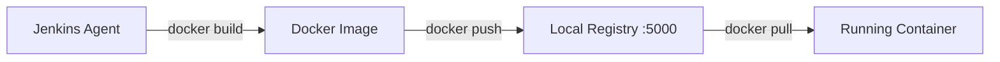

# Docker Build

## What is a Container?

A container is a lightweight, standalone package that includes everything needed to run a piece of software: the code, runtime, libraries, and system tools. Containers ensure your application runs the same way everywhere — your machine, a colleague's machine, or a production server.

**Docker** is the tool that builds and runs containers.

## The Dockerfile

A Dockerfile is a recipe for building a container image. Our address book Dockerfile lives in the [`address-book`](https://github.com/jasoncalalang/address-book) repo at [`Dockerfile`](https://github.com/jasoncalalang/address-book/blob/main/Dockerfile):

```dockerfile
FROM eclipse-temurin:21-jre-alpine
WORKDIR /app
COPY build/libs/*.jar app.jar
EXPOSE 8080
ENTRYPOINT ["java", "-jar", "app.jar"]
```

Line by line:

| Line | Meaning |
|---|---|
| `FROM eclipse-temurin:21-jre-alpine` | Start from a base image that has Java 21 runtime |
| `WORKDIR /app` | Set the working directory inside the container |
| `COPY build/libs/*.jar app.jar` | Copy the built JAR file into the container |
| `EXPOSE 8080` | Document that the app listens on port 8080 |
| `ENTRYPOINT [...]` | The command to run when the container starts |

## Image Tagging

Every Docker image has a tag — a version label. In our pipeline:

```
localhost:5000/address-book:1
localhost:5000/address-book:2
localhost:5000/address-book:3
```

The format is `registry/name:tag`. We use the Jenkins build number as the tag, so each build creates a uniquely tagged image.

## The Local Registry

Instead of pushing images to Docker Hub (which requires an account and internet), we run a local Docker registry at `localhost:5000`. It works the same way but stays on your machine.



## Try It Yourself

1. After a successful build, list the images in the local registry:

```bash
curl -s http://localhost:5000/v2/_catalog | python3 -m json.tool
```

2. See all tags for the address book:

```bash
curl -s http://localhost:5000/v2/address-book/tags/list | python3 -m json.tool
```

3. Clone the address-book repo (`git clone https://github.com/jasoncalalang/address-book.git`) and open `address-book/Dockerfile` to read through it
4. Try changing the base image to `eclipse-temurin:21-jdk-alpine` (full JDK instead of JRE), rebuild, and compare the image sizes

## Next

Continue to [Container Scanning](06-container-scanning.md) to learn about security scanning.
