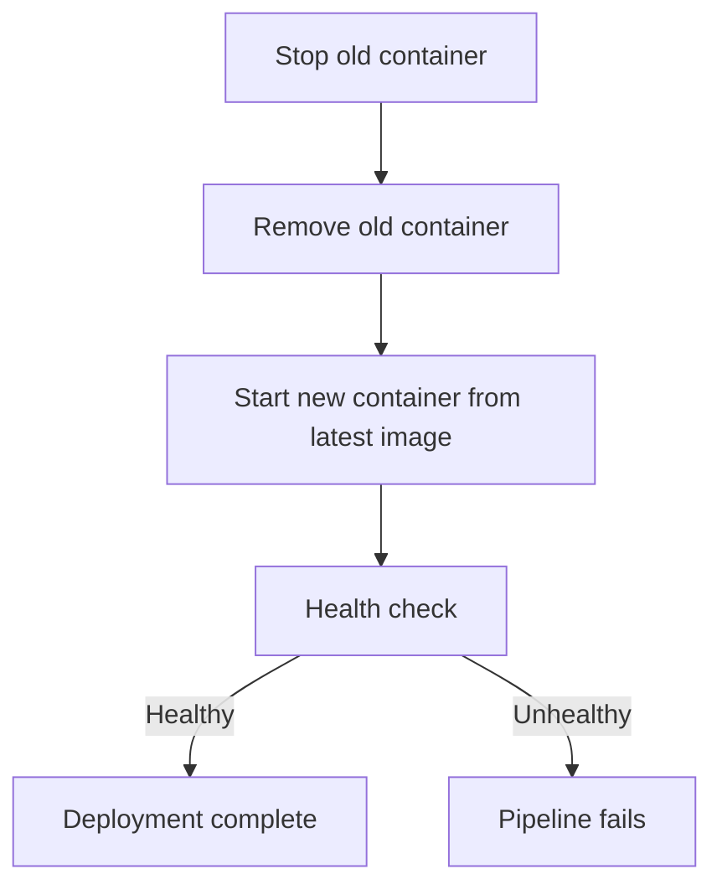

# Deployment

## What is Deployment?

Deployment is the process of making your application available to users. In our pipeline, deployment means starting a Docker container running the latest version of the address book.

## Our Deployment Strategy

We use a simple **stop-and-replace** strategy:



```groovy
stage('Deploy') {
    steps {
        sh """
            docker stop address-book || true
            docker rm address-book || true
            docker run -d \
                --name address-book \
                --network jenkins-net \
                -p 8081:8080 \
                ${IMAGE_TAG}
        """
    }
}
```

Key details:
- `|| true` prevents the pipeline from failing if there's no old container to stop
- `-d` runs the container in the background
- `--network jenkins-net` connects it to the same network as other services
- `-p 8081:8080` maps the container's port 8080 to your machine's port 8081

## Health Checks

After deployment, the pipeline verifies the application started correctly by checking the `/health` endpoint:

```groovy
stage('Health Check') {
    steps {
        sh '''
            for i in $(seq 1 30); do
                if curl -sf http://address-book:8080/health; then
                    echo "Application is healthy!"
                    exit 0
                fi
                sleep 2
            done
            exit 1
        '''
    }
}
```

This retries every 2 seconds for up to 60 seconds. If the app doesn't respond, the pipeline fails — something went wrong with deployment.

## Try It Yourself

1. After a successful build, verify the app is running:

```bash
curl http://localhost:8081/api/contacts
```

2. Check the running containers:

```bash
docker ps | grep address-book
```

3. View the application logs:

```bash
docker logs address-book
```

## Next

Continue to [Agents](08-agents.md) to learn about Jenkins controller/agent architecture.
