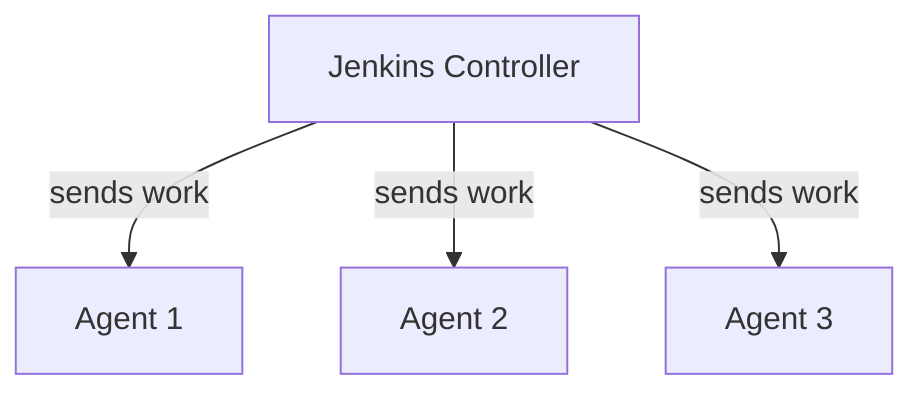
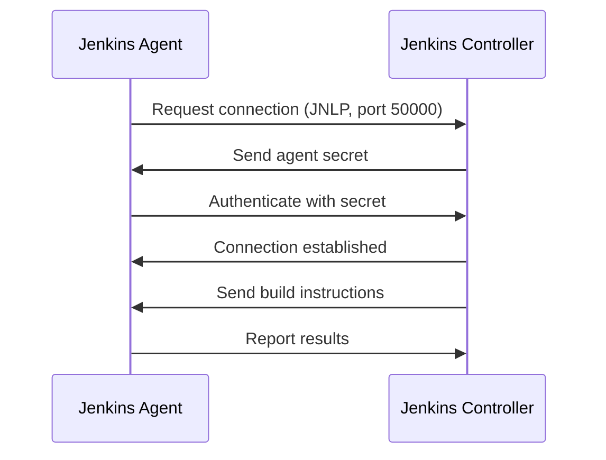

# Jenkins Agents

## Controller vs Agent

Jenkins uses a **controller/agent** architecture:



- **Controller**: Manages configurations, schedules builds, serves the web UI. Does NOT run builds.
- **Agent**: Executes build steps. Can have different tools and environments installed.

### Why Use Agents?

1. **Isolation**: Build tools and dependencies stay on agents, not the controller
2. **Scalability**: Add more agents to run more builds in parallel
3. **Specialization**: Different agents for different platforms (Linux, Windows, macOS)
4. **Security**: The controller doesn't need Docker, compilers, or other build tools installed

## Our Agent Setup

Our agent connects to the controller using **JNLP** (Java Network Launch Protocol):



The agent is configured in Jenkins via JCasC (`jenkins/casc/jenkins.yaml`):

```yaml
nodes:
  - permanent:
      name: "docker-agent"
      remoteFS: "/home/jenkins/agent"
      numExecutors: 2
      labelString: "docker-agent"
      launcher:
        jnlp: {}
```

The Jenkinsfile targets this agent with:

```groovy
agent { label 'docker-agent' }
```

## What's Installed on Our Agent

| Tool | Purpose |
|---|---|
| JDK 21 | Compile and run Java code |
| Docker CLI | Build and push container images |
| Trivy | Scan container images for vulnerabilities |
| Git | Check out source code |

The Gradle wrapper (`./gradlew`) is included in the repository, so Gradle doesn't need to be installed separately.

## Try It Yourself

1. In Jenkins, go to **Manage Jenkins** → **Nodes** to see the agent status
2. Click on **docker-agent** to see its details: number of executors, labels, connected status
3. Check agent logs:

```bash
docker compose logs jenkins-agent
```

## Next

Continue to [Webhooks](09-webhooks.md) to learn about automatic build triggers.
