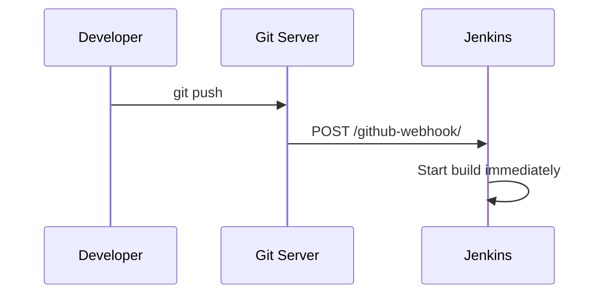

# Webhooks

## Build Triggers

There are several ways to trigger a Jenkins build:

1. **Manual**: Click "Build Now" in the UI
2. **Poll SCM**: Jenkins periodically checks for new commits
3. **Webhook**: The Git server notifies Jenkins immediately when code is pushed

## Poll SCM

Our pipeline uses Poll SCM as the default trigger:

```groovy
triggers {
    scm('H/5 * * * *')
}
```

This means Jenkins checks the Git repository every 5 minutes for changes. If it finds new commits, it triggers a build.

**Downside**: There's a delay (up to 5 minutes) between pushing code and the build starting.

## Webhooks

Webhooks provide instant feedback. When you push code, the Git server sends an HTTP request to Jenkins, which immediately starts a build.



### Why Webhooks Need a Tunnel

Our Jenkins runs on `localhost:8080` — it's not accessible from the internet. GitHub can't send a webhook to `localhost`. To work around this in a local setup, you need a **tunnel** that exposes your local Jenkins to the internet.

### Setting Up with ngrok (Optional Exercise)

[ngrok](https://ngrok.com/) creates a public URL that tunnels to your local machine.

1. Install ngrok:

```bash
# macOS
brew install ngrok

# Or download from https://ngrok.com/download
```

2. Create a free account at https://ngrok.com and get your auth token

3. Configure ngrok:

```bash
ngrok config add-authtoken YOUR_TOKEN
```

4. Start the tunnel:

```bash
ngrok http 8080
```

5. Copy the public URL (e.g., `https://abc123.ngrok-free.app`)

6. In your GitHub repository, go to **Settings** → **Webhooks** → **Add webhook**:
   - **Payload URL**: `https://abc123.ngrok-free.app/github-webhook/`
   - **Content type**: `application/json`
   - **Events**: Just the push event

7. Now every `git push` triggers a build instantly

Note: The ngrok URL changes each time you restart it (on the free plan).

## Next

Continue to [Troubleshooting](10-troubleshooting.md) for help with common issues.
